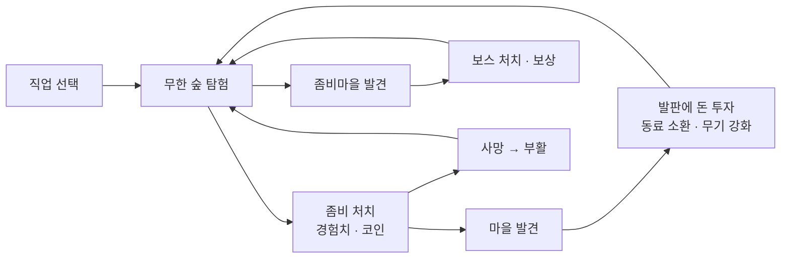

# RotForest
_구 Zombie Hunter, 리마스터 후 RotForest_
> 언리얼 엔진 5(C++ 중심)로 제작한 탑다운 로그라이트 게임입니다.
> 절차적으로 무한히 생성되는 숲을 탐험하며, 직업을 골라 적들을 잡고 돈을 모아
> 동료를 늘리고 무기를 강화하는 한 판 단위의 게임입니다.

| 항목 | 내용 |
|---|---|
| 장르 | 탑다운 로그라이트 |
| 엔진 | Unreal Engine 5.4 |
| 플랫폼 | PC(키보드·마우스/패드), Android(가상 조이스틱) |
| 개발 기간 | 2025.12.15 ~ 2026.02.14 / 2026.06.15 ~ 진행 중 |
| 인원 | 1인 개발 |
| 영상 | [플레이 영상 (YouTube)](https://youtu.be/d2GGSKTJa9c) |

---
# 문서
- [게임 플레이](Docs/Gameplay.md)

## 게임플레이 루프

---
# 에셋 목록
- [ElfArden](https://www.fab.com/listings/53b68688-f8c0-4bc3-8612-7dce8df63b87)
- [SKnight_modular](https://www.fab.com/listings/fc3a309a-a3eb-46de-bebe-dcb40dc31e48)
- [Necropolis](https://www.fab.com/listings/b3d214c2-50fa-4a0e-a780-bee56c1baf8f)
- [Assassin](https://www.fab.com/listings/c12ff2cb-2548-4b5a-bca6-7f52f7a85ce6)
- [VFX_Magic](https://www.fab.com/listings/da3e48f2-d703-4233-b667-d3f57a4c787a)
